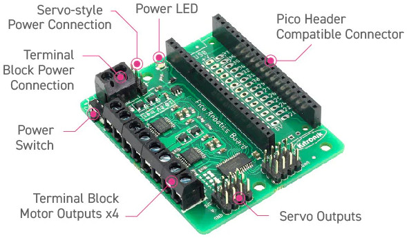

Other Languages: [FRANCAIS](README_FR.md)

# Kitronik-Pico-Robotics-Board-MicroPython



A class and sample code to use the Kitronik Robotics board for Raspberry Pi Pico. (www.kitronik.co.uk/5329)

This is the microPython version. For CircuitPython see: https://github.com/KitronikLtd/Kitronik-Pico-Robotics-Board-CircuitPython

To use save `PicoRobotics.py` file onto the Pico so it can be imported

## Import the library and construct an instance:
``` python
import PicoRobotics
board = PicoRobotics.KitronikPicoRobotics()
```
This will initialise the PCA to default values.

## Drive a motor:
``` python
board.motorOn(motor, direction, speed)
```
where:
* __motor__ => 1 to 4
* __direction__ => f or r
* __speed__ => 0 to 100

## Stop a motor:
``` python
board.motorOff(motor)
```
where:
* __motor__ => 1 to 4

## Drive a Servo:
``` python
board.servoWrite(servo, degrees)
```
where:
* __servo__ => 1 to 8
* __degrees__ => 0-180

## Drive a Stepper:
``` python
board.step(stepperMotor,direction,steps)
```
where:
* __stepperMotor__ => 1 or 2 (stepper 1 is DC motors 1 and 2, stepper 2 is DC motors 3 and 4)
* __direction__ => f or r
* __steps__ => how many steps to make

### To step an angle:
``` python
board.stepAngle(stepperMotor, direction, angle)
```
where
* __stepperMotor__ => 1 or 2 (stepper 1 is DC motors 1 and 2, stepper 2 is DC motors 3 and 4)
* __direction__ => f or r
* __angle__ => how many degrees to move

The stepper code assumes 200 steps per rev (1.8 degrees resolution) and only does full steps.
There are defaulted parameters for stepper speeds (default 20mS pause between steps), hold position when finished stepping (off - saves energy) and how many steps per rev (200). Look at the function headers and function comments in [PicoRobotics.py](PicoRobotics.py) for more detail if you need to change them.

# Troubleshooting

If the code is run without the Pico Robotics board connected, or  if the board is not powered up it islikely that it will throw an OS Error (usually OS Error 5).
This is because it tries to communicate with an I2C device which is not responding.

This code is designed to be used as a module. See: https://kitronik.co.uk/blogs/resources/modules-micro-python-and-the-raspberry-pi-pico for more information
