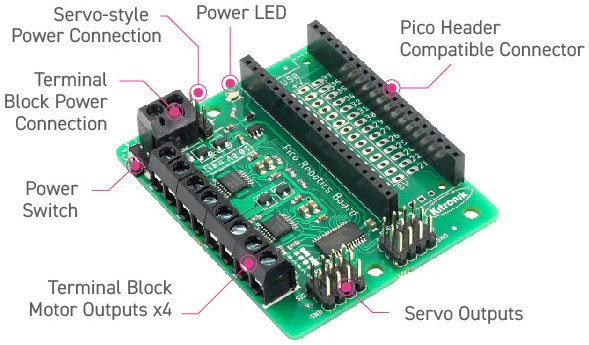

# Kitronik-Pico-Robotics-Board-MicroPython
__Crédit:__ le fichier [README](README.md) est traduit par [MCHobby](https://shop.mchobby.be) - the [README](README.md) file is translated by [MCHobby](https://shop.mchobby.be)



Une classe et code d'exemple de la carte Robotics de Kitronik pour Raspberry Pi Pico (www.kitronik.co.uk/5329) .

Ce README concerne la __version MicroPython__, pour CircuitPython [voir ici](https://github.com/KitronikLtd/Kitronik-Pico-Robotics-Board-CircuitPython) .

Avant usage, copiez le fichier `PicoRobotics.py` sur votre Pico pour qu'il puisse être importé.

## Importer la bibliothèque et créer une instance
``` python
import PicoRobotics
board = PicoRobotics.KitronikPicoRobotics()
```
Cela initialise le circuit PCA avec les valeurs par défaut.

## Piloter un moteur
``` python
board.motorOn(motor, direction, speed)
```
Où:
* __motor__ => 1 à 4. Le moteur à commander.
* __direction__ => f ou r. Sens de rotation, "f" pour sens horlogique/avant (_forward_) et "r" pour sens anti-horlogique/arrière (_reverse_).
* __speed__ => 0 à 100. Fixe la vitesse de rotation (entre 0 et 100%).

## Arrêter un moteur
``` python
board.motorOff(motor)
```
Où:
* __motor__ => 1 à 4. Le moteur à arrêter.

## Piloter un Servo:
``` python
board.servoWrite(servo, degrees)
```
Où:
* __servo__ => 1 à 8. Numéro de sortie sur lequel est branché le servo-moteur.
* __degrees__ => 0-180. Angle en degrés.

## Piloter un moteur pas-à-pas
``` python
board.step(stepperMotor,direction,steps)
```
Où:
* __stepperMotor__ => 1 ou 2. Le moteur pas-à-pas 1 est branché sur les sorties moteurs 1 et 2, moteur pas-à-pas 2 est branché sur les sorties moteurs 3 et 4
* __direction__ => f ou r. Utiliser "f" pour sens horlogique/avant (_forward_) et "r" pour le sens anti-horlogique/arrière (_reverse_)
* __steps__ => Le nombre de pas à avancer. Pour un moteur avec 200 pas/rotation, 50 pas équivaut a un angle de 90°.

### Rotation angulaire
``` python
board.stepAngle(stepperMotor, direction, angle)
```
Où
* __stepperMotor__ => 1 ou 2. Le moteur pas-à-pas 1 est branché sur les sorties moteurs 1 et 2, moteur pas-à-pas 2 est branché sur les sorties moteurs 3 et 4.
* __direction__ => f ou r. Utiliser "f" pour sens horlogique/avant (_forward_) et "r" pour le sens anti-horlogique/arrière (_reverse_)
* __angle__ => Angle de rotation à ajouter (en degrés).

Le code part du principe qu'il s'agit d'un moteur ayant 200 pas par révolution (résolution de 1.8 degrés/pas) et qu'il fonctionne en pas complet (_full step_).
Il y a des paramètres par défaut pour le moteur pas-à-pas:
* 20mS de pause entre les pas,
* Tenue de la position après chaque rotation (_off_ pour économiser de l'énergie),
* 200 pas par révolution.

Inspectez l'entête et commentaires des méthodes de [PicoRobotics.py](PicoRobotics.py) pour plus d'information (si vous désirez modifier ces valeurs).

# Dépannage

Si le code est exécuté sans avoir connecté la carte Robotique ou si la carte n'est pas alimentée alors la bibliothèques produira une erreur système (habituellement _OS Error 5_).
Cette erreur est provoquée lors que la bibliothèque essaye de communiquer avec le périphérique I2C (mais qu'il ne répond pas).

Le code est conçu pour être utilisé comme un module. Voir [modules micropython and the raspberry-pi pico](https://kitronik.co.uk/blogs/resources/modules-micro-python-and-the-raspberry-pi-pico) (_Blog KitroniK, Anglais_) pour plus d'information
